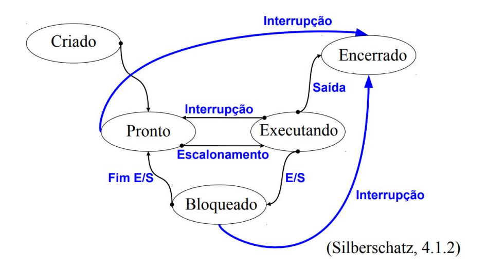
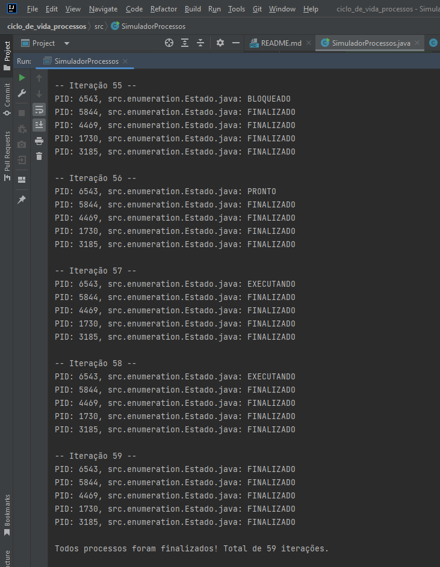

# Ciclo de Vida de Processos
## Descrição

Este projeto simula o ciclo de vida de N processos em Java. O objetivo é demonstrar como os processos mudam de estado ao longo do tempo, utilizando aleatoriedade para representar as transições de estado. Os estados dos processos são:

- **Novo**: O processo foi criado, mas ainda não está pronto para ser executado.
- **Pronto**: O processo está pronto para ser executado e aguarda a alocação de CPU.
- **Executando**: O processo está atualmente sendo executado.
- **Bloqueado**: O processo não pode continuar sua execução devido a um evento externo (como I/O).
- **Finalizado**: O processo completou sua execução e foi encerrado.

A simulação continua até que todos os processos cheguem ao estado Finalizado.

## Simulação das Interações

